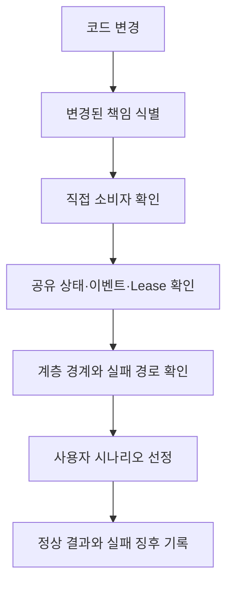
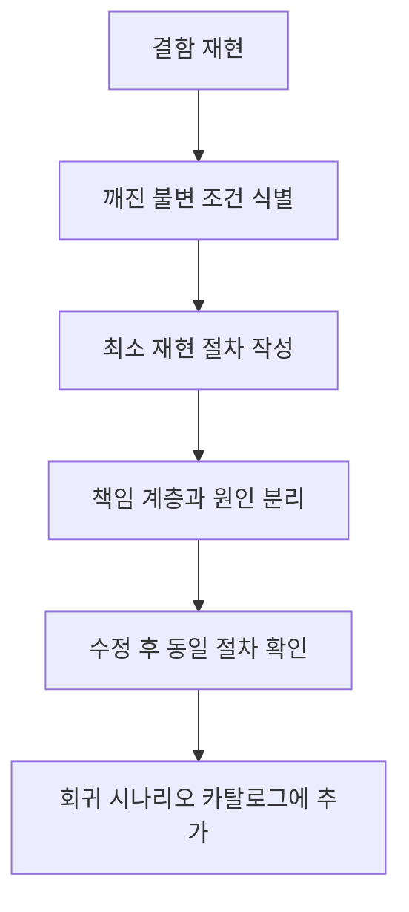

# MyNotes 회귀 검증 기준

> 이 문서는 MyNotes의 코드 변경이 기존 사용자 흐름을 깨뜨리지 않았는지 판단하기 위한 프로젝트 공통 기준입니다.  
> 변경된 파일의 개수보다 **변경된 책임, 공유 상태, 객체 수명, 계층 경계와 사용자 흐름**을 기준으로 검증 범위를 결정합니다.

## 1. 목적

MyNotes는 독립 노트 창, 계층형 탐색, 자동 저장, SQLite, Lucene 검색, ViewModel Lease 등 여러 상태와 수명 주기가 연결된 데스크톱 앱입니다. 앱이 복잡해질수록 개발자의 기억만으로 회귀 지점을 찾으면 확인 누락이 발생할 가능성이 커집니다.

이 문서의 목적은 다음과 같습니다.

- 변경 유형에 따라 확인할 사용자 흐름을 일관되게 선택
- 정상 동작을 구성하는 불변 조건 명시
- 직접 영향뿐 아니라 공유 상태와 계층 경계의 간접 영향 식별
- 위험도에 따라 검증 깊이와 중단 지점 결정
- 발견된 결함을 재사용 가능한 회귀 시나리오로 축적

## 2. 회귀 검증의 기본 원칙

### 2.1 파일이 아니라 책임을 기준으로 판단

한 파일의 변경이 여러 화면에 영향을 줄 수 있고, 여러 파일의 변경이 하나의 사용자 기능만 바꿀 수도 있습니다. 따라서 다음 순서로 영향 범위를 판단합니다.



### 2.2 정상 경로와 경계 경로를 함께 확인

정상 입력만 확인해서는 수명 및 상태 결함을 찾기 어렵습니다. 각 변경에는 가능한 범위에서 다음 경계를 포함합니다.

- 최초 실행과 재실행
- 초기화 완료 전 취소·이동·창 닫기
- 빈 데이터와 많은 데이터
- 빠른 연속 입력과 중복 명령
- 마지막 참조 해제와 다시 열기
- 성공 직후 다른 화면에서 상태 확인
- 저장 실패·조회 실패·색인 실패 등 부분 실패

### 2.3 확인된 사실과 추론을 구분

- **확인된 결함:** 재현 절차와 실패 결과가 존재하는 상태
- **회귀 후보:** 변경 구조상 영향을 받을 가능성이 있지만 아직 재현하지 않은 상태
- **정상 확인:** 정해진 시나리오에서 기대 결과를 관찰한 상태

재현하지 않은 위험을 결함으로 단정하지 않습니다. 반대로 빌드 성공만으로 사용자 흐름이 정상이라고 판단하지 않습니다.

## 3. MyNotes 핵심 불변 조건

아래 조건은 구현 방식과 관계없이 항상 유지되어야 합니다.

### 3.1 내비게이션

- 선택된 Navigation 항목과 Frame에 표시된 콘텐츠가 일치해야 합니다.
- 초기 페이지, 마지막으로 연 페이지 및 설정된 시작 페이지가 정책에 맞게 열려야 합니다.
- 뒤로 가기는 실제 방문 순서대로 한 단계씩 복원되어야 합니다.
- 검색 진입과 복귀가 선택 상태와 뒤로 가기 스택을 깨뜨리지 않아야 합니다.
- 그룹 노드의 펼침·접힘이 현재 콘텐츠를 의도하지 않게 변경하지 않아야 합니다.
- 목록·그룹의 생성, 이동, 이름 변경 및 삭제 후 트리와 저장 상태가 일치해야 합니다.

### 3.2 노트 생성·이동·삭제·복원

- 새 노트는 지정된 사용자 목록에 한 번만 나타나야 합니다.
- 노트 이동 후 원본 목록에서는 사라지고 대상 목록에는 한 번만 나타나야 합니다.
- 북마크 상태 변경은 노트 창과 북마크 목록에 즉시 동일하게 반영되어야 합니다.
- 휴지통 이동 후 일반 목록·북마크·검색 결과에서 정책에 맞게 제거되어야 합니다.
- 복원된 노트는 대상 목록에 나타나고 휴지통에서는 제거되어야 합니다.
- 영구 삭제된 노트는 모든 목록, 열린 창, DB 및 검색 결과에서 다시 노출되지 않아야 합니다.
- 명령이 실패하면 메모리 모델만 성공 상태로 남아서는 안 됩니다.

### 3.3 편집·자동 저장

- 빠른 연속 편집은 최종 콘텐츠를 보존해야 합니다.
- 오래된 저장 요청이 최신 입력을 덮어써서는 안 됩니다.
- 창 종료 시 대기 중인 변경이 정책에 따라 Flush되거나 명시적으로 처리되어야 합니다.
- 제목·본문 변경 후 노트 창, 미리보기, 정렬 순서 및 검색 색인이 서로 일치해야 합니다.
- 저장 실패 시 사용자 데이터가 저장된 것처럼 표시되어서는 안 됩니다.

### 3.4 ViewModel Lease와 객체 수명

- 동일한 노트를 여러 화면과 창에서 사용해도 공유 ViewModel 상태가 일관되어야 합니다.
- 유효한 Lease가 하나라도 남아 있으면 ViewModel과 DI Scope가 해제되어서는 안 됩니다.
- 마지막 Lease 해제 시 ViewModel, 메시지 구독 및 Scope가 한 번만 정리되어야 합니다.
- 해제된 ViewModel을 다시 사용하거나 중복 Dispose해서는 안 됩니다.
- 초기화 실패 중 생성된 Lease와 Scope도 누수 없이 정리되어야 합니다.
- Dispose 중 예외가 발생해도 캐시가 영구적으로 사용할 수 없는 상태에 머물러서는 안 됩니다.

### 3.5 데이터와 검색 색인

- SQLite는 원본 데이터이며 Lucene 결과는 SQLite의 최신 상태와 결합되어야 합니다.
- 제목·본문 생성, 수정 및 삭제 후 검색 색인이 같은 상태를 나타내야 합니다.
- 검색 결과의 관련도 순서가 DB 조회 순서로 바뀌어서는 안 됩니다.
- 여러 조회 배치의 경계에서도 결과 누락·중복·순서 변경이 없어야 합니다.
- DB 트랜잭션이 완료되지 않으면 관련 변경이 부분적으로 남아서는 안 됩니다.
- 커밋되지 않은 트랜잭션은 Dispose 시 롤백되어야 합니다.

### 3.6 다중 창과 상태 복원

- 같은 노트를 중복 창으로 열지 않는 정책이 유지되어야 합니다.
- 노트 창의 위치, 크기, 항상 위 표시 및 배경 설정이 재실행 후 복원되어야 합니다.
- 메인 창과 노트 창의 활성화 상태가 서로 잘못 전파되어서는 안 됩니다.
- 앱 종료·재실행 후 열려 있던 창과 Navigation 상태가 저장 정책에 맞게 복원되어야 합니다.
- 초기화 도중 창을 닫아도 예외와 참조 누수가 발생하지 않아야 합니다.

### 3.7 UI 설정과 접근성

- Grid/List, 타일 크기·비율, 정렬 설정이 화면과 재실행 후 상태에 반영되어야 합니다.
- 한·영 리소스가 동일한 기능과 의미를 제공해야 합니다.
- 키보드 탐색, 포커스, 제목 표시줄 입력 영역과 주요 명령이 유지되어야 합니다.
- 창 크기와 배율 변경 후 콘텐츠가 잘리거나 조작 불가능해져서는 안 됩니다.

## 4. 변경 유형별 필수 확인 범위

| 변경 유형 | 직접 확인 | 간접·경계 확인 |
| --- | --- | --- |
| View/XAML | 표시, 입력, 바인딩, 포커스 | 창 크기, DPI, 테마, 지역화, 접근성 |
| ViewModel | 명령, 속성 알림, 정렬, 선택 | 초기화, Dispose, 메시지 구독, 재진입 |
| Navigation | 메뉴 선택, 페이지 이동 | 초기 진입, 검색, 뒤로 가기, 그룹 노드, 상태 복원 |
| NoteCommandService | 생성·이동·삭제·복원 | 원본/대상/북마크/검색/휴지통의 즉시 동기화 |
| Messenger·토큰 | 발신과 수신 | 중복 등록, 누락, 순서, 해제 후 수신 여부 |
| Provider·Lease | Resolve, Acquire, Dispose | 동시 접근, 마지막 해제, 재생성, 초기화 실패 |
| 자동 저장·비동기 흐름 | 단일 변경 저장 | 빠른 입력, 취소, 종료 Flush, 오래된 요청 역전 |
| Application 서비스 | 유스케이스 성공 결과 | 실패·취소·부분 성공, Presentation 상태 복구 |
| EF Core·트랜잭션 | 저장·조회 결과 | 롤백, 중복 호출, Dispose, 동시 갱신 |
| Lucene 검색 | 검색 결과와 강조 | 관련도 순서, 배치 경계, 누락 ID, DB와 색인 정합성 |
| 다중 창 | 열기, 닫기, 활성화 | 동일 노트 재진입, 상태 공유, 앱 종료·복원 |
| 이미지·파일 | 추가, 표시, 삭제 | 파일 실패, 캐시, 노트 삭제, 여러 창 격리 |
| 설정·패키징 | 저장·로드, 앱 실행 | 업데이트, 재설치, 기존 데이터, COM·Widget·Jump List |

## 5. 영향 범위 분류

모든 변경은 다음 세 범위로 나눕니다.

1. **직접 영향**  
   변경된 클래스가 바로 담당하는 기능입니다.
2. **간접 영향**  
   같은 모델, Provider, 메시지, 캐시 또는 설정을 공유하는 기능입니다.
3. **경계 영향**  
   계층 간 전달, 비동기 완료, 초기화·해제, 오류 복구처럼 책임이 만나는 지점입니다.

예를 들어 `NavigationController` 또는 `MainViewModel`의 선택 처리를 변경했다면 다음을 포함합니다.

| 범위 | 확인 대상 |
| --- | --- |
| 직접 | 메뉴 클릭 후 해당 페이지 표시 |
| 간접 | 선택 표시, 마지막 페이지 저장, 검색 진입 |
| 경계 | 초기 페이지, 뒤로 가기, 그룹 노드, 창 종료 시 이벤트 해제 |

## 6. 위험 점수와 검증 깊이

변경마다 다음 항목에 해당하면 1점을 부여합니다.

- 둘 이상의 화면 또는 창에서 사용
- 공유 Model·ViewModel·캐시 상태 변경
- Provider, Lease 또는 Dispose 관련
- 비동기·취소·동시성 관련
- DB 또는 파일 데이터 변경
- Lucene 등 파생 상태 변경
- Messenger·이벤트·콜백 변경
- 앱 시작·종료·복원 관련
- 패키징·배포·Windows 통합 관련
- 실패 시 사용자 데이터 손실 가능

| 점수 | 검증 수준 | 기준 |
| --- | --- | --- |
| 0~2 | 낮음 | 직접 기능과 대표 정상 경로 확인 |
| 3~5 | 중간 | 직접·간접 영향 및 대표 실패 경로 확인 |
| 6~7 | 높음 | 경계 시나리오, 재실행, 중복·취소·종료 확인 |
| 8~10 | 매우 높음 | 데이터 보존, 복구 가능성, 다중 창·동시성까지 집중 확인 |

점수는 결함 가능성을 확정하는 수치가 아니라 **검증 범위를 빠뜨리지 않기 위한 의사결정 도구**입니다.

## 7. 핵심 회귀 시나리오 카탈로그

### 7.1 내비게이션 기본 흐름

1. 앱 시작 후 정책에 맞는 초기 페이지 표시
2. 홈 → 북마크 → 사용자 목록 순서로 이동
3. 검색 실행 후 결과 페이지 표시
4. 뒤로 가기로 검색 전 페이지와 선택 항목 복원
5. 사용자 그룹 펼침·접힘 후 현재 콘텐츠 유지
6. 앱 재실행 후 마지막 페이지 또는 설정된 시작 페이지 복원

정상 결과는 선택 항목, Frame 콘텐츠와 뒤로 가기 스택이 항상 일치하는 것입니다.

### 7.2 노트 생명주기

1. 사용자 목록에서 노트 생성
2. 제목과 본문을 빠르게 연속 편집
3. 다른 목록으로 이동
4. 북마크 추가·해제
5. 휴지통으로 이동
6. 복원 후 대상 목록 확인
7. 다시 삭제하고 영구 삭제

각 단계에서 원본·대상·북마크·검색·휴지통의 잔존, 누락 및 중복을 확인합니다.

### 7.3 Lease와 다중 창

1. 한 노트를 목록과 검색 결과에 동시에 노출
2. 같은 노트 창 열기
3. 한 화면에서 Lease 해제
4. 남은 창과 화면에서 편집·표시 정상 여부 확인
5. 마지막 참조 해제
6. 같은 노트를 다시 열어 새 인스턴스가 정상 초기화되는지 확인

### 7.4 자동 저장과 종료

1. 본문을 빠르게 여러 번 수정
2. 저장 대기 시간 안에 창 닫기
3. 앱 재실행 후 최종 입력 확인
4. 제목 변경으로 미리보기 정렬과 검색 결과 확인
5. 초기화가 완료되기 전에 창 닫기

### 7.5 검색 정합성

1. 제목과 본문에 검색어가 있는 노트 준비
2. 검색 결과 순서와 강조 범위 확인
3. 노트 수정 후 이전 검색어에서 제거되는지 확인
4. 새 검색어에서 나타나는지 확인
5. 삭제·복원·영구 삭제 후 결과 반영 확인
6. 결과가 여러 조회 배치로 나뉘는 경우 누락·중복·순서 확인

### 7.6 설정과 재실행

1. Grid/List 전환
2. 타일 크기·비율 및 정렬 변경
3. 노트 창 배경·이미지·불투명도 변경
4. 앱 종료 후 재실행
5. 목록 설정과 창 상태가 동일하게 복원되는지 확인

## 8. 변경 전·후 체크리스트

### 변경 전

- [ ] 변경 목적을 한 문장으로 설명할 수 있음
- [ ] 변경 책임 계층을 식별함
- [ ] 직접·간접·경계 소비자를 찾음
- [ ] 관련 핵심 불변 조건을 선택함
- [ ] 위험 점수를 산정함
- [ ] 정상 결과와 실패 징후를 먼저 정의함

### 변경 후

- [ ] 직접 기능이 정상임
- [ ] 공유 상태가 다른 화면에 올바르게 반영됨
- [ ] 초기화·취소·종료 경로가 안전함
- [ ] Lease와 이벤트 구독이 정상 해제됨
- [ ] 실패 시 메모리와 영속 상태가 모순되지 않음
- [ ] 재실행 후 데이터와 화면 상태가 유지됨
- [ ] 발견된 결함을 재현 가능한 시나리오로 기록함
- [ ] 커밋 설명에 확인한 사용자 흐름을 남김

## 9. 회귀 시나리오 기록 양식

```markdown
### 시나리오: <사용자 관점의 이름>

- 관련 변경:
- 책임 계층:
- 위험 점수:
- 상태: 확인 전 / 정상 / 결함 확인 / 보류
- 선행 조건:
- 실행 순서:
  1.
  2.
  3.
- 정상 결과:
- 실패 징후:
- 사용자 영향:
- 실패 시 우선 확인 계층:
- 자동화 가능 여부:
- 마지막 확인일:
- 관련 커밋 또는 이슈:
```

## 10. 결함 발견 시 운영 규칙

결함은 수정하고 끝내지 않고 다음 순서로 회귀 자산으로 남깁니다.



- 사용자 동작 기준으로 이름을 붙입니다.
- 재현에 필요하지 않은 단계를 제거합니다.
- 수정한 파일보다 깨진 책임과 불변 조건을 기록합니다.
- 같은 원인의 변형 시나리오가 있는지 확인합니다.
- 반복 가능하고 안정적인 시나리오는 자동화 후보로 분류합니다.

## 11. 우선순위 결정 기준

다음 순서로 먼저 확인합니다.

1. 데이터 손실·손상·복구 불가 가능성
2. 앱 시작·종료·저장 실패
3. 노트 생성·편집·삭제·복원 등 핵심 흐름
4. Navigation과 다중 화면 상태 불일치
5. Lease·동시성·메시지 중복으로 인한 장시간 실행 문제
6. 검색 결과·정렬·설정 유지 문제
7. 시각적 품질과 부가 기능

시간이 부족하면 현재 최고 위험 시나리오의 정상·실패 경계까지 확인하고, 후속 시나리오는 확인 전 상태와 이유를 명시한 뒤 중단합니다.

## 12. 완료 기준

회귀 검증은 단순히 앱이 실행되는 것으로 완료되지 않습니다. 다음 조건을 충족해야 합니다.

- 선택한 핵심 불변 조건이 모두 유지됨
- 직접·간접·경계 시나리오의 결과가 기록됨
- 정상 결과와 실제 관찰 결과가 일치함
- 발견된 실패의 사용자 영향과 책임 계층이 분류됨
- 보류한 항목과 중단 지점이 명확함
- 새 결함의 재현 절차가 회귀 시나리오로 축적됨

---

## 빠른 적용 요약

변경할 때마다 다음 다섯 질문에 답합니다.

1. 무엇의 책임을 바꾸었는가?
2. 같은 상태·이벤트·Lease를 공유하는 화면은 어디인가?
3. 초기화·실패·취소·종료 중 어느 경계가 영향을 받는가?
4. 사용자가 관찰해야 할 정상 결과와 실패 징후는 무엇인가?
5. 이번 결함이 다시 발생하지 않도록 어떤 시나리오를 남길 것인가?

> **변경된 파일을 따라 검증하지 말고, 변경된 책임에서 사용자 흐름까지 이어지는 경로를 따라 검증합니다.**
