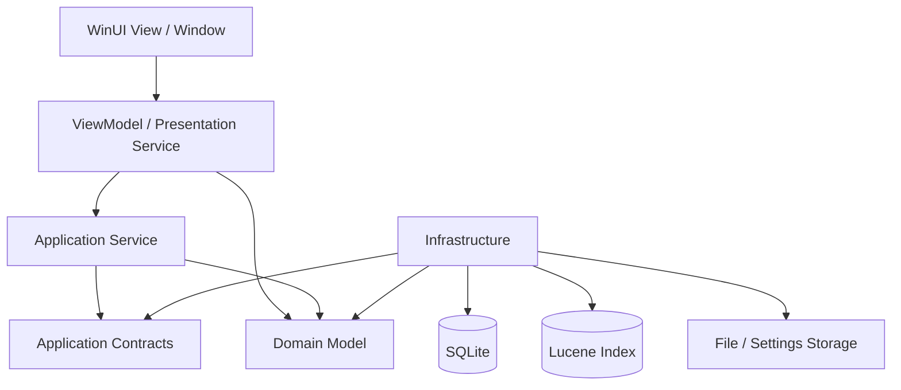
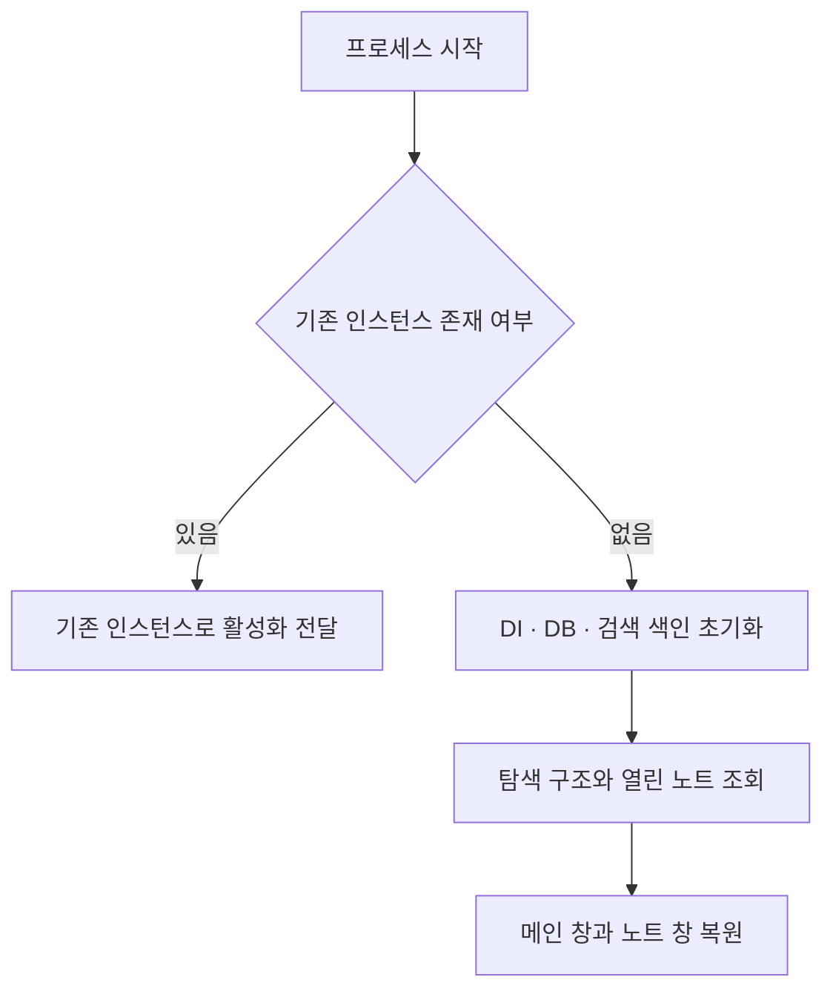
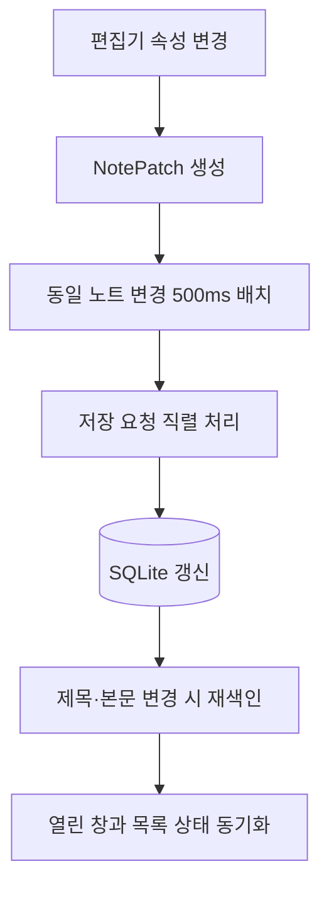

# MyNotes

> 노트를 독립적인 Windows 창으로 관리하고, 탐색 목록·자동 저장·전문 검색·창 상태 복원을 지원하는 WinUI 3 기반 로컬 우선 데스크톱 메모 애플리케이션입니다.

MyNotes는 빠르게 메모를 작성하는 기능에서 출발해, 노트가 많아졌을 때도 원하는 내용을 쉽게 분류하고 다시 찾을 수 있도록 확장한 Windows 데스크톱 앱입니다. 각 노트를 별도 창으로 열어 바탕화면 위에 배치할 수 있으며, 사용자 정의 목록과 그룹, 미리보기, 북마크, 휴지통, Lucene 기반 검색을 하나의 흐름으로 제공합니다.

현재 주요 사용 흐름은 구현되어 있으며, 기능 중심으로 성장한 초기 구조를 계층화하고 객체 수명·동시성·데이터 정합성을 강화하는 리팩터링을 지속하고 있습니다.

## 주요 기능

- **다중 노트 창**: 여러 노트를 독립된 창으로 열고 위치, 크기, 항상 위 표시 등의 창 상태를 관리합니다.
- **사용자 정의 탐색 구조**: 목록과 그룹을 생성하고 계층적으로 구성하며 노트를 원하는 목록에 배치합니다.
- **노트 미리보기**: 탐색 위치에 따라 노트를 목록 또는 타일 형태로 표시하고 제목, 생성일, 수정일 기준 정렬을 지원합니다.
- **자동 저장**: 연속된 편집 요청을 짧은 시간 동안 모아 처리하고, 동일 노트의 중복 저장 요청을 조정합니다.
- **전문 검색**: Lucene.NET 기반 N-gram 색인을 사용해 제목과 본문을 검색하고, 결과를 비동기 스트림으로 표시합니다.
- **검색 결과 강조**: 검색어와 일치하는 본문 구간을 미리보기에서 강조합니다.
- **북마크와 휴지통**: 중요한 노트를 모아 보고 삭제된 노트를 별도로 관리합니다.
- **이미지 관리**: 노트에 연결된 이미지의 메타데이터와 로컬 파일을 함께 관리합니다.
- **상태 복원**: 앱 시작 시 이전에 열려 있던 노트 창과 메인 창 상태를 복원합니다.
- **Windows 통합**: 단일 앱 인스턴스, 활성화 리디렉션, Jump List, 시작 프로그램 및 Widget 확장을 고려한 구조를 포함합니다.

## 기술 스택

| 구분 | 기술 |
| --- | --- |
| 언어·런타임 | C# 14, .NET 10 |
| UI | WinUI 3, Windows App SDK 2.4 |
| UI 패턴 | MVVM, CommunityToolkit.Mvvm |
| 애플리케이션 구성 | Microsoft.Extensions.DependencyInjection |
| 데이터베이스 | EF Core 10, SQLite |
| 검색 | Lucene.NET 4.8 beta, 사용자 정의 N-gram Analyzer |
| 비동기·유틸리티 | Task, Channel, IAsyncEnumerable, TimeProvider, DotNext |
| 패키징 | Windows Application Packaging Project, MSIX |
| 코드 품질 | Nullable Reference Types, 사용자 정의 Roslyn Analyzer |

## 아키텍처

Presentation, Application, Domain, Infrastructure의 책임을 분리하고, Application Contracts를 경계로 애플리케이션 로직과 외부 구현을 연결합니다.



### 프로젝트 구성

| 프로젝트 | 책임 |
| --- | --- |
| `MyNotes` | WinUI View, ViewModel, 화면 조정 서비스, DI 구성 |
| `MyNotes.Application` | 노트·탐색·이미지 유스케이스와 애플리케이션 규칙 |
| `MyNotes.Application.Contracts` | DTO, 명령, 조회 조건, 저장소 인터페이스 |
| `MyNotes.Domain` | 노트·탐색·이미지 식별자와 핵심 도메인 모델 |
| `MyNotes.Infrastructure` | EF Core, SQLite, Lucene, 파일 저장소, 로깅, Windows 연동 구현 |
| `MyNotes.Presentation.Contracts` | 창 제어 등 Presentation 경계의 추상화 |
| `MyNotes.Templates` | 재사용 가능한 WinUI 컨트롤과 스타일 |
| `MyNotes.Common` | 컬렉션, 메시지, 수명주기, 공통 연산과 유틸리티 |
| `MyNotes.Debugging` | 참조 추적과 디버깅 지원 |
| `MyNotes.Analyzer` | 프로젝트 규칙을 검사하는 사용자 정의 Roslyn Analyzer |
| `MyNotes.Package` | MSIX 패키징, 시작 프로그램 및 Widget 등록 |

## 핵심 흐름

### 1. 앱 시작과 창 복원



`AppInstance`로 단일 인스턴스를 유지하고, 새 활성화 요청은 실행 중인 프로세스로 전달합니다. 최초 실행 프로세스는 데이터베이스와 검색 컨텍스트를 준비한 뒤 탐색 구조와 열려 있던 노트를 불러와 창을 복원합니다.

### 2. 노트 생성

새 노트를 만들면 Application 계층이 기본 노트와 창 상태를 생성합니다. Infrastructure 계층은 하나의 DB 트랜잭션에서 노트와 ViewState를 저장하고 Lucene 검색 문서를 작성합니다. 필요한 저장 과정이 완료되면 새 노트 모델과 미리보기 ViewModel을 만들고 독립된 노트 창을 엽니다.

### 3. 편집과 자동 저장



빠르게 연속되는 편집은 `NoteUpdateBatcher`가 노트별로 조정합니다. 같은 주기의 이전 요청을 중단 상태로 전환하고 최신 변경을 직렬 Dispatcher에 전달해 불필요한 저장과 경합을 줄입니다. Batcher가 종료될 때는 남은 변경을 Flush해 데이터 유실을 방지합니다.

### 4. 검색과 미리보기

검색어는 Lucene 색인으로 전달되며, 검색 결과는 `IAsyncEnumerable`을 통해 준비되는 순서대로 Application 계층에 도착합니다. 각 결과는 SQLite의 최신 노트 데이터와 결합되고, 제목·본문 일치 횟수와 범위를 포함한 검색 결과 DTO로 변환됩니다. 검색 전용 미리보기 ViewModel은 전달받은 범위를 이용해 본문의 일치 구간을 강조합니다.

## 주요 설계 결정

### SQLite와 Lucene의 역할 분리

SQLite를 노트 데이터의 원본으로 사용하고 Lucene은 검색 전용 파생 색인으로 사용합니다. 노트를 생성하거나 제목·본문을 수정할 때 색인을 함께 갱신하며, 조회 결과에는 SQLite의 최신 데이터를 사용합니다.

### 변경 배치와 직렬 처리

텍스트 편집은 짧은 시간에 많은 변경 이벤트를 발생시킵니다. 변경마다 DB에 접근하지 않도록 동일 노트의 요청을 배치하고, 실제 저장은 Dispatcher를 통해 순서대로 수행합니다. 이를 통해 UI 응답성을 유지하면서 변경 순서와 종료 시점의 저장을 제어합니다.

### ViewModel Lease와 참조 계수

하나의 노트가 메인 목록, 검색 결과, 별도 노트 창 등 여러 화면에서 동시에 사용될 수 있습니다. ViewModel 공급자는 공유 인스턴스를 Lease 형태로 제공하고 참조 수가 0이 되는 시점에 ViewModel과 DI Scope를 정리합니다. 공급자 캐시는 동시 접근과 해제 경합을 고려해 구성했습니다.

### 데이터와 화면 상태의 분리

노트의 제목·본문·북마크 여부와 창 크기·위치·배경·항상 위 표시 같은 ViewState를 구분해 저장합니다. 콘텐츠 변경과 화면 배치 변경의 수명 및 갱신 빈도를 독립적으로 다룰 수 있습니다.

## 개발 환경

- Windows 10 1809 이상
- Windows 11 권장
- Visual Studio Community 2026
- .NET 10 SDK
- Windows App SDK 및 Windows 애플리케이션 개발 구성 요소

## 빌드 및 실행

### Visual Studio에서 패키지로 실행

앱은 패키지 ID를 사용하는 Windows 기능과 저장소 API를 포함하므로, 일반적인 개발·실행 경로는 패키징 프로젝트를 사용하는 방식입니다.

1. Visual Studio에서 `MyNotes.slnx`를 엽니다.
2. `MyNotes.Package`를 시작 프로젝트로 지정합니다.
3. `Debug`와 `x64` 구성을 선택합니다.
4. 배포 후 디버깅을 시작합니다.

### CLI에서 앱 프로젝트 빌드

다음 명령으로 x64 Debug 기준 소스 컴파일을 확인할 수 있습니다.

```powershell
dotnet build MyNotes/MyNotes.csproj -c Debug -p:Platform=x64
```

이 명령은 앱 프로젝트를 빌드하지만 MSIX 배포와 패키지 활성화까지 수행하지는 않습니다. 패키지 전용 기능을 포함한 실제 실행 확인에는 Visual Studio의 `MyNotes.Package` 실행 경로를 사용합니다.

## 현재 개발 상태

주요 노트 작성·탐색·자동 저장·검색·다중 창 흐름은 구현되어 있습니다. 현재는 기능 중심으로 확장된 초기 구조를 정리하면서 다음 영역을 보완하고 있습니다.

- 일반화된 노트 조회·필터 조건 완성
- 탐색 이동 실패와 순서 재조정 처리 강화
- 초기화 및 사용자 작업 실패에 대한 오류 처리 통합
- 패키징과 배포 흐름 정리
- 접근성, 키보드 탐색 및 반응형 레이아웃 점검
- 미사용 코드와 리팩터링 잔여 구조 정리

## 프로젝트에서 다룬 문제

이 프로젝트는 기능 구현뿐 아니라 장기간 실행되는 데스크톱 앱에서 발생하는 다음 문제를 직접 다루는 데 중점을 두고 있습니다.

- 여러 창과 화면이 같은 노트를 공유할 때의 객체 수명 관리
- 빠른 편집 입력으로 발생하는 중복 저장과 비동기 경합
- 관계형 데이터와 검색 색인 사이의 정합성
- 앱 재실행 후 창과 탐색 상태 복원
- 검색 결과 스트리밍과 미리보기 강조
- 계층형 탐색 항목의 생성, 이동 및 순서 유지

---

MyNotes는 기능을 빠르게 추가한 초기 구현을 출발점으로, 책임 경계와 실패 처리, 동시성, 객체 수명을 명시적으로 다루는 구조로 발전시키고 있는 개인 프로젝트입니다.
